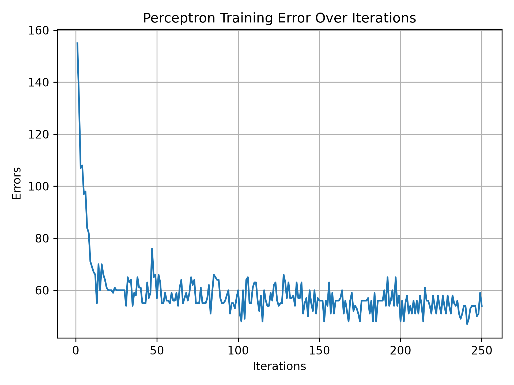

# The Perceptron

## Summary

- Author: Frank Rosenblatt
- Year: 1958

The perceptron is the most simplest machine learning algorithm which was designed to work on linearly separable datasets. It is based on the model of a biological neuron. It takes one or more inputs and produces a binary output. Each input is associated with a weight that determines its contribution to the output. The weighted sum of all inputs is passed through an activation function. In this case, it is a step function. The perceptron learns by adjusting its weights based on the error in its output compared to the desired output.

## How to run

```
# Create virtual env and install dependencies

python -m venv .venv
pip install -r requirements.txt
cd 01_perceptron

# Train the model

python train.py

# Evaluate the model

python evaluate.py
```

## Results

### Metrics

- Accuracy : 0.923  
- Precision: 0.988  
- Recall   : 0.888  
- F1 Score : 0.935

### Error Curve

