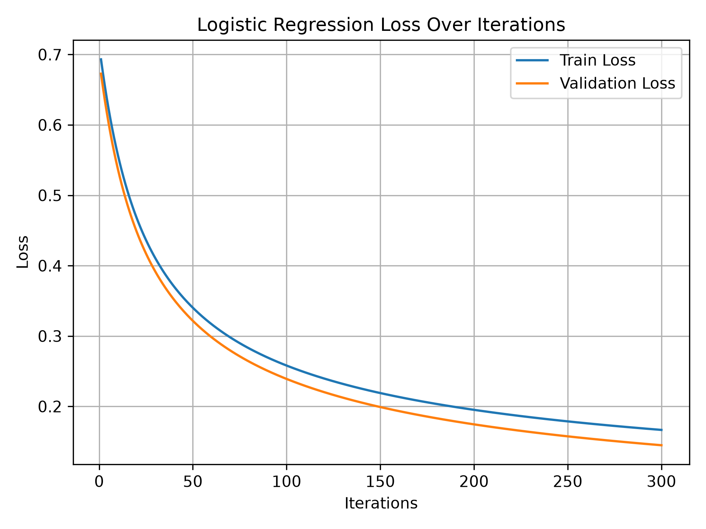
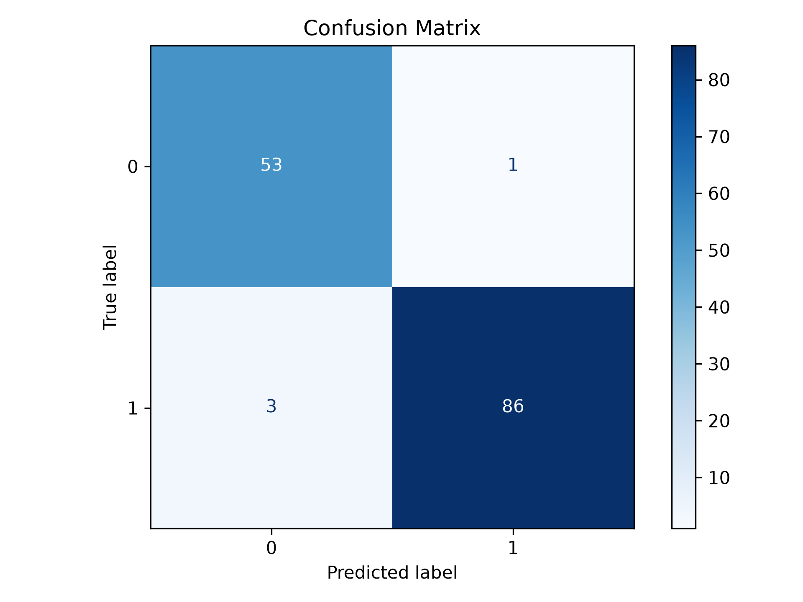

# Logistic Regression

## Summary

Logistic Regression is a machine learning algorithm used for classification. It works by computing a linear combination of input feautures and passing it through a sigmoid function to produce a probability between 0 and 1. This probability is then used to assign the input to a class based on the threshold value (0.5). This algorithm uses a loss function called the Log Loss (binary cross-entropy) to evaluate its performance. To minimize the loss, gradient descent is used.

## How to run

```
# Create virtual env and install dependencies

python -m venv .venv
pip install -r requirements.txt
cd 02_logistic_regression

# Train the model

python train.py

# Evaluate the model

python evaluate.py
```

## Results

### Metrics

- Accuracy : 0.972
- Precision: 0.989
- Recall   : 0.966
- F1 Score : 0.977

### Loss Curve



### Confusion Matrix

